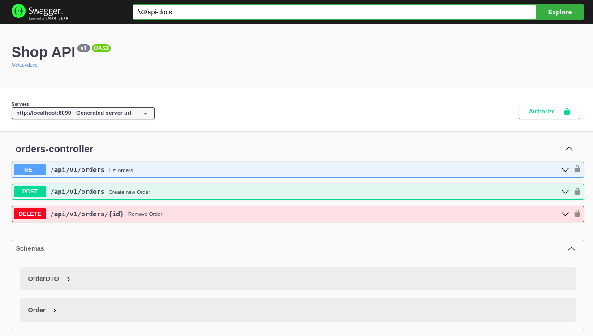

# Setup:
With installed [docker-compose](https://docs.docker.com/compose/install/) and running [docker](https://www.docker.com/):

* enter project directory
* run ``docker-compose up`` - command will start up two containers with __MongoDB__ and __Application__

### Application:
* runs on http://localhost:8090
* exposes swagger documentation on http://localhost:8090/docs \

* has predefined two users [code](https://github.com/AMatyszczak/friendly-fishstick/blob/main/src/main/java/com/example/friendly_fishstick/SecurityConfig.java#L59)
  * ADMIN 
    * can create orders, list all orders, list order for a particular user, delete orders
    * has predefined credentials: {admin:password}
  * CUSTOMER
    * can create orders, list their own orders
    * has predefined credentials: {customer:password}
* on every run clears and loads database with 6 orders [code](https://github.com/AMatyszczak/friendly-fishstick/blob/main/src/main/java/com/example/friendly_fishstick/FriendlyFishstickApplication.java#L26)

### MongoDB:
* exposes port 27020
* initiated with:
  * root username: root
  * root password: secret
  * database: shop
  * shop username: user
  * shop password: secret

### Dockerfile
* consists of two stages
  * first - copies repository source code inside container and builds jar file
  * second - copies jar file from first container and executes it

# Application stack
- java 17
- spring boot 3.1
- spring-boot-web
- spring-boot-data-mongodb - for connection with mongo
- spring-boot-security - to handle role based authentication
- springdoc-openapi-starter-webmvc-ui - to create swagger documentation